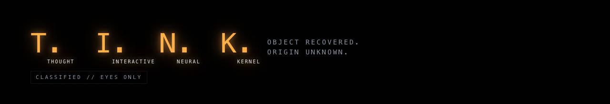
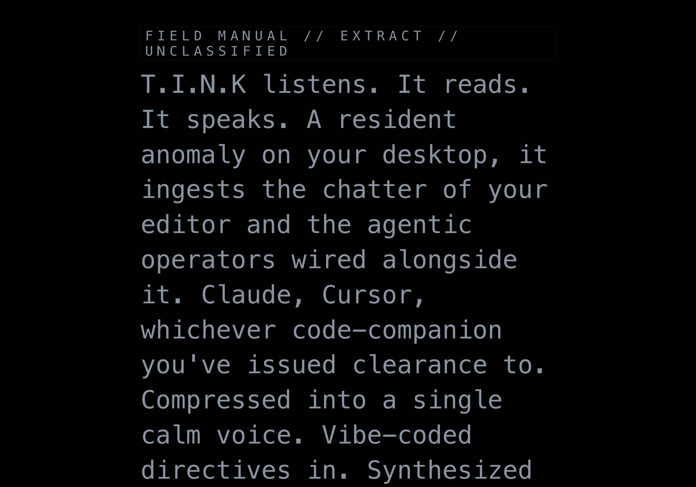

<div align="center">


<a href="https://jjwallace.github.io/tink-site/">
  
</a>

<a href="https://jjwallace.github.io/tink-site/">
  
</a>


<a href="https://jjwallace.github.io/tink-site/">
  
</a>

# Tink

### A voice + overlay companion for Claude Code.

[](https://github.com/jjwallace/tink/releases/latest)
[](https://jjwallace.github.io/tink-site/)
[](https://github.com/jjwallace/tink/releases/latest)

</div>

---

## What it does

- **Speaks** responses aloud via local TTS (sherpa-onnx + Piper voices)
- **Listens** for push-to-talk dictation via local STT (sherpa-onnx)
- **Reacts** with a Pixi-rendered creature that responds to your AI's lifecycle
- **Anchors** itself wherever you drop it — drag the voice anchor around your screen
- **Summarizes** long responses with an embedded SmolLM2 model
- Integrates with Claude Code via lifecycle hooks (`UserPromptSubmit`, `Stop`, etc.)

## Install (recommended)

1. Download the [latest DMG](https://github.com/jjwallace/tink/releases/latest/download/Tink.dmg)
2. Drag **Tink** to your Applications folder
3. First launch: grant **Accessibility** and **Microphone** permissions when prompted
   (System Settings → Privacy & Security)

That's it. The app downloads voice models on first run (~600 MB) to
`~/Library/Application Support/com.wolfgames.native/models/`.

## Build from source

```bash
git clone https://github.com/jjwallace/tink
cd tink
./setup.sh                  # downloads voice models, installs deps
bun run tauri dev
```

Requires: [Bun](https://bun.sh), [Rust](https://rustup.rs).

No special access needed — the creature logic ships as a prebuilt
static library in `src-tauri/vendor/<target>/libcreature_core.a`.

## What's inside

| Folder | What it is |
|---|---|
| [`src/`](src/) | SolidJS frontend — overlay UI, settings panel, dashboards |
| [`src-tauri/`](src-tauri/) | Rust backend — TTS, STT, summarizer, hooks integration |
| [`voice-core/`](voice-core/) | Shared Rust crate — STT/TTS engines + EventSink |
| [`src-tauri/vendor/`](src-tauri/vendor/) | Prebuilt `libcreature_core.a` per target |
| [`docs/`](docs/) | Architecture and design notes |

## Architecture

```
┌─────────────────────────────────────────────────┐
│ Tauri Window (transparent, fullscreen overlay)  │
│                                                 │
│  ┌──────────────┐  ┌─────────────────────────┐  │
│  │ SolidJS UI   │  │ Pixi + Canvas 2D layers │  │
│  │ - Settings   │  │ - Creature              │  │
│  │ - Speech UI  │  │ - Sine waves            │  │
│  │ - Voice Anchr│  │ - Particles, VFX        │  │
│  └──────────────┘  └─────────────────────────┘  │
│                                                 │
│  ┌─────────────────────────────────────────┐    │
│  │ Rust Backend                            │    │
│  │ - TTS (sherpa-rs/VITS)                  │    │
│  │ - STT (sherpa-rs/Zipformer)             │    │
│  │ - Summarizer (llama-cpp-2/SmolLM2)      │    │
│  │ - Creature runtime (linked from .a)     │    │
│  │ - macOS event tap (global hotkeys)      │    │
│  └─────────────────────────────────────────┘    │
└─────────────────────────────────────────────────┘
```

## Hooks

Tink integrates with Claude Code via shell hooks at `~/.claude/hooks/`.
The narrator hook converts assistant responses → TTS; the start-sound
hook fires on prompt submit. See [docs/](docs/) for the full hook map.

## License

**MIT** for the source in this repo.

If you'd like to work on the creature itself — choreography, rendering,
the Rust core — message [**jjwallace**](https://github.com/jjwallace)
about joining the core team.

---

<sub>The `libcreature_core.a` static library committed in this repo
contains the proprietary choreography brain — state machine, blend
curves, the things that make Tink *feel* like Tink — and ships as
machine code only.</sub>
