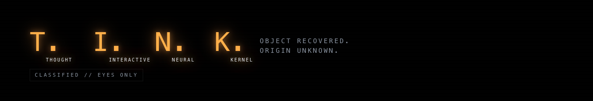
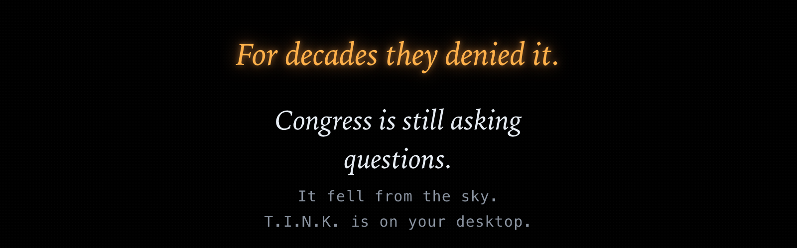
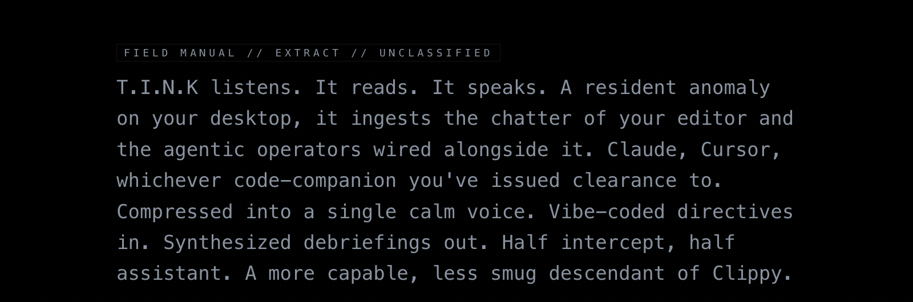

<div align="center">


<a href="https://hellotink.com/">
  
</a>


<a href="https://hellotink.com/">
  
</a>


<a href="https://hellotink.com/">
  
</a>

# Tink

### A voice + overlay companion for Claude Code.

[](https://github.com/jjwallace/tink/releases/latest)
[](https://hellotink.com/)
[](https://github.com/jjwallace/tink/releases/latest)

</div>

---

## What it does

- **Speaks** responses aloud via local TTS (sherpa-onnx + Piper voices)
- **Listens** for push-to-talk dictation via local STT (sherpa-onnx)
- **Reacts** with a Pixi-rendered creature that responds to your AI's lifecycle
- **Anchors** itself wherever you drop it — drag the voice anchor around your screen
- **Summarizes** long responses with an embedded SmolLM2 model
- Integrates with Claude Code via lifecycle hooks (`UserPromptSubmit`, `Stop`, etc.)

## Install sequence

**01 · Download** — macOS · Apple Silicon (M1 – M4)

[**github.com/jjwallace/tink/releases/latest**](https://github.com/jjwallace/tink/releases/latest) ↗

**02 · Install** — Open the DMG and drag **Tink** into Applications. Then remove the
quarantine flag — required because Tink isn't from the App Store:

```bash
xattr -cr /Applications/Tink.app
```

**03 · Grant Accessibility** — Launch Tink. It opens System Settings automatically.
Find Tink in the list and toggle it on. Required for the push-to-talk hotkey to work
system-wide.

```
System Settings → Privacy & Security → Accessibility
```

**04 · Wait for models** — On first launch Tink downloads three local AI models
(~200 MB total):

- **Alba** — Scottish voice (TTS)
- **Moonshine Tiny** — speech recognition (STT)
- **SmolLM2 360M** — narration summarizer

Open Settings from the tray icon to watch progress. Once downloaded, they live
offline in `~/Library/Application Support/com.wolfgames.tink/`.

**05 · Set your hotkey** — Open Settings → Text to Speech → click the hotkey chiclet
and press your chosen key. F-keys and arrow keys work bare; letters/digits need a
modifier (e.g. Cmd+Shift+Space). Hold to speak, release to paste the transcription.

> **Microphone permission:** macOS will prompt the first time you press the push-to-talk key.

## Build from source

```bash
git clone https://github.com/jjwallace/tink
cd tink
./setup.sh                  # downloads voice models, installs deps
bun run tauri dev
```

Requires: [Bun](https://bun.sh), [Rust](https://rustup.rs).

Everything ships as source — the creature choreography, rendering, and Rust
core are all in this repo. No prebuilt blobs, no private packages.

## What's inside

| Folder | What it is |
|---|---|
| [`src/`](src/) | SolidJS frontend — overlay UI, creature, voice anchor, settings panel |
| [`src/features/creature/`](src/features/creature/) | Creature choreography, orchestrator, renderer, companions |
| [`src/features/voice-anchor/`](src/features/voice-anchor/) | Drag, mode cycle, particle anchor |
| [`src-tauri/`](src-tauri/) | Rust backend — TTS, STT, summarizer, hooks, window gating |
| [`voice-core/`](voice-core/) | Shared Rust crate — STT/TTS/summarizer engines + EventSink |
| [`docs/`](docs/) | Architecture and design notes |

## Architecture

```
┌─────────────────────────────────────────────────┐
│ Tauri Window (transparent, fullscreen overlay)  │
│                                                 │
│  ┌──────────────┐  ┌─────────────────────────┐  │
│  │ SolidJS UI   │  │ Pixi + Canvas 2D layers │  │
│  │ - Settings   │  │ - Creature              │  │
│  │ - Speech UI  │  │ - Sine waves            │  │
│  │ - Voice Anchr│  │ - Particles, VFX        │  │
│  └──────────────┘  └─────────────────────────┘  │
│                                                 │
│  ┌─────────────────────────────────────────┐    │
│  │ Rust Backend                            │    │
│  │ - TTS (sherpa-rs/VITS)                  │    │
│  │ - STT (sherpa-rs/Zipformer)             │    │
│  │ - Summarizer (llama-cpp-2/SmolLM2)      │    │
│  │ - macOS event tap (global hotkeys)      │    │
│  └─────────────────────────────────────────┘    │
└─────────────────────────────────────────────────┘
```

## Hooks

Tink integrates with Claude Code via shell hooks at `~/.claude/hooks/`.
The narrator hook converts assistant responses → TTS; the start-sound
hook fires on prompt submit. See [docs/](docs/) for the full hook map.

## License

**MIT** — all of it. Creature choreography, rendering, the Rust core: it's
all here, fully open. PRs welcome.
